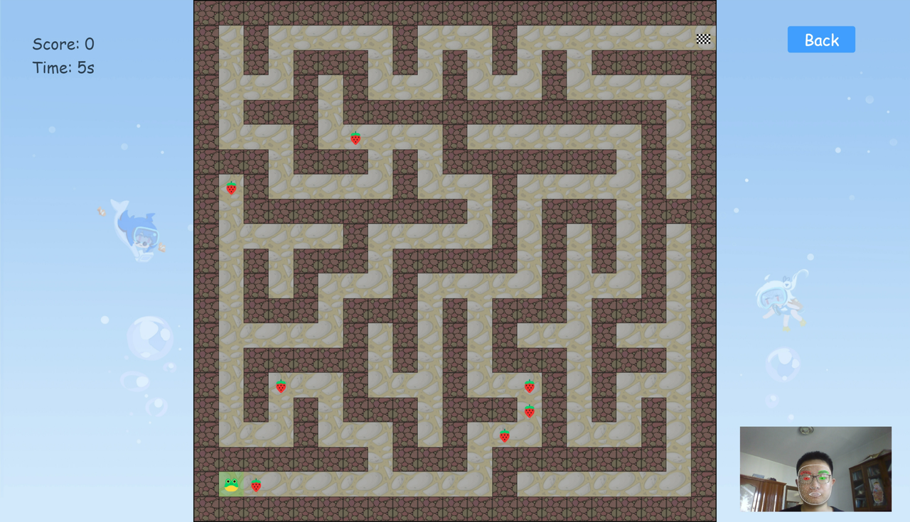
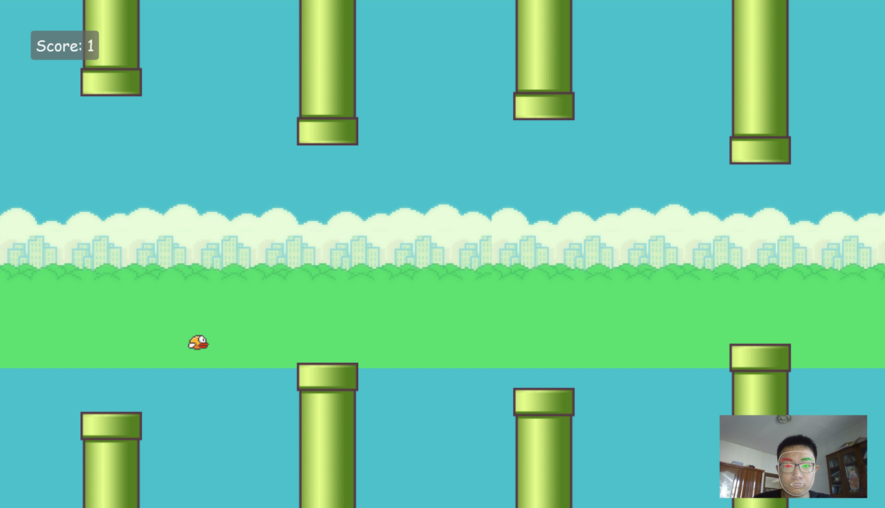

# Face Mesh Games

同济大学用户交互课程项目

## 简介

使用[Mediapipe](https://google.github.io/mediapipe/)检测人脸，推测头部的上下左右，从而作为用户与小游戏交互的方式。实现了两个小游戏：Flappy Bird与走迷宫。

在线体验：[Face Mesh (linzhouli.github.io)](https://linzhouli.github.io/face-mesh-games/#/)

## 运行

**Install**

```
yarn install
```

**run**

```
yarn dev
```

## 页面展示

**首页**


**走迷宫**



**Flappy Bird**



## 关键代码实现

### 头部方向检测

从摄像头每一帧图像中，通过机器学习模型可以推断得到头部468个关键的三维坐标。提取出**两个眼睛与鼻子**的三个关键点，使用这三个点组成三角形，并计算其**法向量**。此法向量即面部朝向的方向向量，设置阈值即可判断头部朝向。

```JavaScript
onResults(results) {

    if (results.multiFaceLandmarks.length == 0) // 未检测到人脸
      return DIRECTION.NONE;

    const landmarks = results.multiFaceLandmarks[0]; // 468个关键点坐标的数组
    let leftEye = this.getMidPoint(landmarks, this.#leftEyePoints); // 左眼点坐标
    let rightEye = this.getMidPoint(landmarks, this.#rightEyePoints); // 右眼点坐标
    let noise = this.getMidPoint(landmarks, this.#nosePoints); // 鼻子坐标
    let triangle = new THREE.Triangle(leftEye, rightEye, noise); // 计算面部三角面
    let normal = new THREE.Vector3();
    triangle.getNormal(normal); // 计算面部法向量

    let result; // 根据法向量朝向判断头部方向
    if (normal.x > this.#rightThres) result = DIRECTION.RIGHT;
    else if (normal.x < this.#leftThres) result = DIRECTION.LEFT;
    else if (normal.y > this.#upThres) result = DIRECTION.UP;
    else if (normal.y < this.#downThres) result = DIRECTION.DOWN;
    else result = DIRECTION.NONE;

    return result;

 }
```

### 防抖

防抖，即一定时间间隔内用户只能触发一次效果。如果没有防抖，由于每一帧都进行头部位置检测，用户一次点头的时间就可能触发多次效果。为此，我们设计的防抖方法是：

1. 记录上一帧的检测结果。

1. 如果当前帧检测结果与上一帧不同，那么不考虑防抖，立即返回检测结果。然后设置定时器。

1. 如果当前帧检测结果与上一帧相同，那么考虑防抖。如果定时器时间未结束，说明时间间隔太小，不返回检测结果；如果定时器时间已结束，就直接返回检测结果。并再次设置定时器。

防抖时间为200~399ms。

```JavaScript
let timer = null;
this.faceMesh.onResults(results => {

  if (this.canvasElement) this.drawResults(results);
  let dir = this.onResults(results);

  if (dir != this.lastDir) { // 头部方向改变, 立即返回结果
    this.lastDir = dir;
    this.cb(dir);
    if (timer) clearTimeout(timer);
    timer = setTimeout(() => timer = null, this.debounceTime); // 设置定时器
  } else if (!timer) { // 头部方向不变, 需要考虑debounceTime
    timer = setTimeout(() => timer = null, this.debounceTime); // 设置定时器
    this.cb(dir);
  }

});
```
